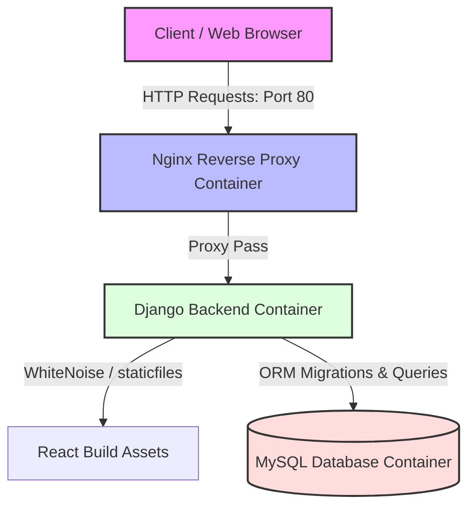

# Django & React Notes Application (Production-Ready Architecture)

Welcome to the **Django-React Notes Application**—a production-grade, multi-container full-stack web application. The application features a robust **Django REST Framework (DRF)** backend, a modern **React** frontend, a high-performance **Nginx** reverse proxy, and a persistent **MySQL** database.

This project is fully dockerized and configured for automated deployments with a **Jenkins CI/CD** pipeline.

---

## Key Enhancements Implemented

To transition this project from a basic setup to a production-ready application, the following enhancements have been implemented:

1. **Dynamic Database Configuration**: Updated `settings.py` to automatically detect environment variables. It seamlessly connects to **MySQL** in containerized environments (via Docker Compose) and automatically falls back to **SQLite** for local, zero-dependency development.
2. **Service Dependency Orchestration**: Added service health checks and health-status-based startup sequencing (`condition: service_healthy`) in `docker-compose.yml` to prevent race conditions. The Django application now waits for the MySQL database to be completely initialized and ready before running migrations and starting Gunicorn.
3. **Upstream Nginx Proxy Routing**: Configured the Nginx reverse proxy to utilize a proper named upstream pool (`upstream django`) for cleaner service-to-service routing and improved scalability.
4. **Robust REST API Error Handling**: Replaced raw database retrievals with `get_object_or_404` and introduced proper standard HTTP status responses (`201 Created`, `400 Bad Request`, `404 Not Found`) in backend views to prevent unhandled `500 Internal Server Errors`.

---

## System Architecture

The following diagram illustrates how incoming client traffic flows through the reverse proxy to the backend, static build files, and persistent database layer:



---

## Project Directory Structure

```plaintext
├── api/                  # Django REST API application (models, views, serializers)
│   ├── migrations/       # Database migrations
│   ├── models.py         # Note database models
│   ├── serializers.py    # DRF serializers
│   └── views.py          # REST view handlers with validation & error handling
├── notesapp/             # Django core settings and URL routers
│   ├── settings.py       # Configured with environment-aware database & security fallbacks
│   └── urls.py           # Core URL mapping (including serving frontend static files)
├── mynotes/              # React frontend codebase
│   ├── build/            # Pre-compiled static assets served by Django (WhiteNoise)
│   ├── public/           # Static public assets
│   ├── src/              # React application source code
│   └── Dockerfile        # Standalone frontend build definition
├── nginx/                # Reverse proxy config files
│   ├── default.conf      # Upstream forwarding and headers definitions
│   └── Dockerfile        # Nginx alpine container definition
├── docker-compose.yml    # Complete multi-container orchestration definition
├── Jenkinsfile           # CI/CD pipeline automation code
├── db.sqlite3            # Local development SQLite database (fallback)
└── requirements.txt      # Python dependencies list
```

---

## Deployment Methods

### Option A: Multi-Container Production Run (Recommended)
This approach launches Nginx, Django, and MySQL altogether using Docker Compose.

1. **Verify or Edit Environment Configuration**:
   Ensure `.env` contains the correct credentials:
   ```env
   DB_NAME=test_db
   DB_USER=root
   DB_PASSWORD=root
   DB_PORT=3306
   DB_HOST=db_cont
   ```

2. **Spin Up the Containers**:
   Execute the following command in the project root:
   ```bash
   docker-compose up --build -d
   ```
   *Docker Compose will automatically build the images, launch MySQL first, wait for the database health check to pass, run Django migrations, start the server, and finally bind Nginx to port `80`.*

3. **Access the App**:
   - Web Frontend: Navigate to [http://localhost/](http://localhost/)
   - Django REST Admin panel: [http://localhost/admin/](http://localhost/admin/)

---

### Option B: Local Development (No Docker)
You can run the frontend and backend locally with zero dependencies on MySQL.

#### 1. Setup Backend
1. Create and activate a Python virtual environment:
   ```bash
   python -m venv venv
   # On Windows:
   .\venv\Scripts\activate
   # On macOS/Linux:
   source venv/bin/activate
   ```
2. Install Python requirements:
   ```bash
   pip install -r requirements.txt
   ```
3. Run migrations (defaults to SQLite):
   ```bash
   python manage.py migrate
   ```
4. Start the Django server:
   ```bash
   python manage.py runserver 8000
   ```

#### 2. Setup Frontend
1. Navigate to the frontend directory:
   ```bash
   cd mynotes
   ```
2. Install Node packages:
   ```bash
   npm install
   ```
3. Start the React development server:
   ```bash
   npm start
   ```
   *React will open at [http://localhost:3000](http://localhost:3000) and automatically proxy all requests to `/api/*` to the Django server running on port `8000`.*

---

## REST API Reference

All backend endpoints are prefixed with `/api`.

| HTTP Method | Endpoint | Request Body | Description | Expected Status |
| :--- | :--- | :--- | :--- | :--- |
| **GET** | `/api/` | None | Returns list of available routes | `200 OK` |
| **GET** | `/api/notes/` | None | Retrieves all notes ordered by last updated | `200 OK` |
| **GET** | `/api/notes/<id>/` | None | Retrieves detail of a single note | `200 OK` / `404 Not Found` |
| **POST** | `/api/notes/create/` | `{"body": "string"}` | Creates a new note | `201 Created` / `400 Bad Request` |
| **PUT** | `/api/notes/<id>/update/` | `{"body": "string"}` | Updates an existing note | `200 OK` / `400 Bad Request` / `404 Not Found` |
| **DELETE** | `/api/notes/<id>/delete/` | None | Deletes a note | `200 OK` / `404 Not Found` |

---

## CI/CD Automation (Jenkins Pipeline)

The repository includes a `Jenkinsfile` for continuous integration and delivery. The stages are automated as follows:

1. **Code Clone**: Clones the specified branch from the GitHub repository.
2. **Code Build**: Builds the application docker image.
3. **Push to Registry**: Uploads the built image to DockerHub using credentials stored in Jenkins.
4. **Deploy**: Triggers deployment to the development server.

> [!NOTE]
> The Jenkins pipeline makes use of a shared Jenkins library helper (`Shared`) to decouple pipeline logic from Jenkinsfile syntax.
